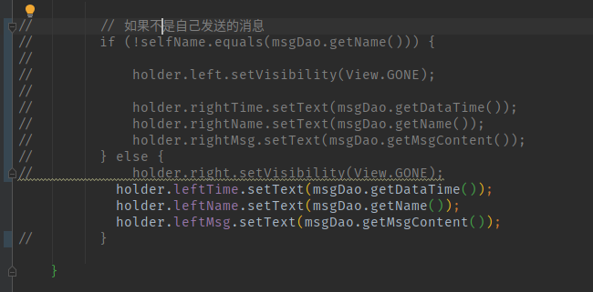

## 实现一个简单的聊天室


### Android
实现注册和保存密码的功能。然后能够实现群聊。

### 后端

后端简单的使用了Python的Flask框架，使用mongodb作为服务器，实现用户注册和保存消息的功能

后端的代码很简单，只实现了一点点功能
```python
from pymongo import MongoClient
import json
import datetime
import hashlib
import time
from urllib.parse import quote, unquote
from flask import Flask, render_template, request, redirect

client = MongoClient()
database = client.android_chat
user_collection = database.user
chat_msg_collection = database.chat_msg
app = Flask(__name__)

@app.route("/login",methods=['POST','GET'])
def login():

    if request.method=='GET':
        name = request.args.get("name")
        pwd = request.args.get("pwd")
    else:
        name =request.form.get('name')
        pwd = request.form.get('pwd')
    rows = user_collection.find({
        'name':name,
        'pwd':pwd
    })
    if rows.count() == 0:
        return  json.dumps({
            'success':False,
            'reason':'登录失败'
        })
    else:
        return  json.dumps({
            'success':True,
            'reason':'登录成功'
        })

@app.route("/register",methods=['POST','GET'])
def register():

    if request.method=='GET':
        name = request.args.get("name")
        pwd = request.args.get("pwd")
    else:
        name =request.form.get('name')
        pwd = request.form.get('pwd')
    print(name)
    row = user_collection.insert_one({
        'name':name,
        'pwd':pwd
    })

    if row != None:
        return  json.dumps({
            'success':True,
            'reason':'注册成功'
        })
    else:
        return  json.dumps({
            'success':False,
            'reason':'注册失败'
        })

@app.route("/sendMsg",methods=['POST','GET'])
def sendMsg():
    if request.method=='GET':
        name = request.args.get("name")
        msg = request.args.get("msg")
    else:
        name =request.form.get('name')
        msg = request.form.get('msg')
    row = chat_msg_collection.insert_one({
        'name':name,
        'msg':msg,
        'time':time.strftime("%Y-%m-%d %H:%M:%S", time.localtime(time.time())),
    })
    if row != None:
        return  json.dumps({
            'success':True,
            'reason':'发送成功'
        })
    else:
        return  json.dumps({
            'success':False,
            'reason':'发送失败'
        })

@app.route("/getMsg")
def getMsg():
    returnMsg = []
    msgList = chat_msg_collection.find()
    print(msgList.count())


    for i in msgList:
        msg = {
            'name': i['name'],
            'msg':i['msg'],
            'time':i['time']
        }
        returnMsg.append(msg)
    dataJson = {
        "data": returnMsg
    }
    return json.dumps(dataJson)

if __name__ == "__main__":
    app.run("0.0.0.0",8080)

```

### 消息逻辑

客户端每次都是请求10条最新的消息到本地，使用http请求（实际上不应该这样做，应该使用Socket，
使用消息订阅发布模式）

### 问题
在聊天界面中，暂时无法实现左右消息的展示，实现的时候有BUG：recycleView中，刚开始进入能够进行左右消息展示，但是如果向下滑动，然后再次向上滑动右边的消息就会消失。

代码图片：



bug问题：
![./git_img/1.png]

在下面的图中，321发送的你好消失
![./git_img/2.png]


